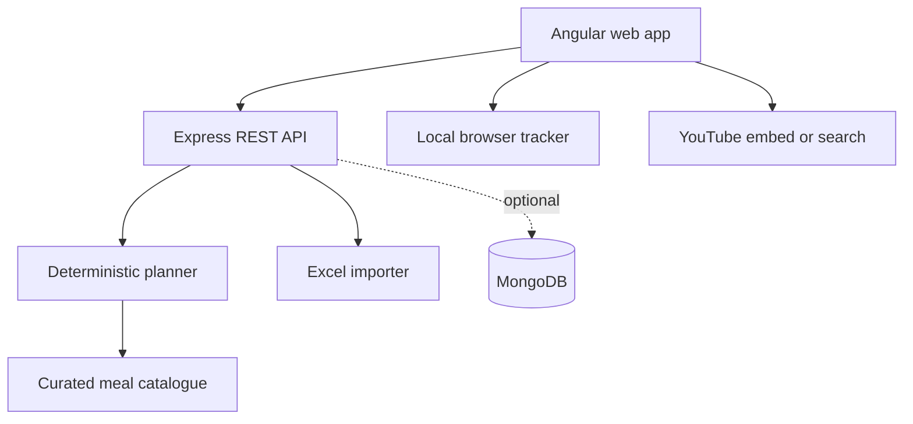
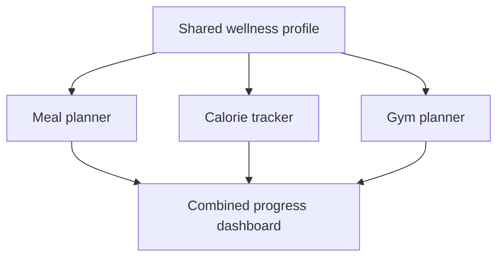

# Architecture

## Planning flow

1. Validate the wellness profile and explicit exclusions.
2. Estimate a general daily energy band from Mifflin-St Jeor, activity and a conservative goal adjustment.
3. Remove meals that conflict with allergies, exclusions or dietary pattern.
4. Score remaining meals for familiarity, pantry overlap, affordability, fibre and protein.
5. Rotate the strongest candidates to avoid excessive repetition.
6. Estimate plan and monthly cost, then create a consolidated ingredient-use list.
7. Return reasons and notices with the plan so suggestions remain explainable.

The initial API is intentionally stateless; it runs without MongoDB. Phase 1.1 can persist profiles, plans and tracking events with user authentication.

## Production hardening backlog

- JWT access/refresh authentication and account deletion
- Encrypted personal/health-adjacent fields
- Mongo repositories and per-user ownership checks
- Background reminder worker (email/push) instead of browser-only demo notifications
- Exact retailer/region price table with effective dates
- Dietitian-reviewed catalogue and formal nutrition data source licensing
- YouTube Data API integration with quota control and safe-content review
- Audit logs, rate limiting, observability and backup/restore tests

## Phase 2 module architecture

Phase 2 should remain within the same MzansiWell Angular application and Express API. Add lazy-loaded `calorie-tracker` and `gym` feature areas, with separate backend modules and collections but the same authenticated user profile.

Exercise media should come from a curated internal exercise catalogue. The catalogue may store reviewed YouTube video identifiers, but the application must not depend on a paid AI API to play or recommend workouts. Real-time guidance in Phase 2 means an on-screen workout session with timers, cues, set/rep advancement and video playback—not automated camera-based form diagnosis.
